# Voting Project

I created this project for fun to learn the blockchain.  
It doesn't have proper form validation.

> DON'T use this project in PRODUCTION. IT is only useful for EDUCATIONAL Purpose.

## Support this project

```
bitcoin: 37bRVCouQ3TW5XMMAmkZ5S8t3ueqdLt7Cs
ethereum: 0x04676E1A013D9554d96752b7429c92612d44A9AB
```

## Introduction

This voting project is based on Indian Election Process.

There are 2 contracts. First is ElectionFactory and Second is Election.
All the Election will be created using ElectionFactory.

This Dapp is for education purpose not for any production.

Server side Web3js is used for this Dapp.
All the transaction will be signed by server.

Client side Web3js will be added soon.

Following are the work still not completed:

1. Revert message from contract is not replicated on React application.
2. It is assumed that in Every consituency one party must get majority votes.
3. Form Validation is not implemented.

## System requirement

1. nodejs 8.x or greater (This dapp is developed on node v8.x)
2. npm install -g ganache-cli

## Set up

1. git clone https://github.com/schadokar/election-ethereum-react-dapp.git
2. npm install (Install all the server and ethereum dependencies)
3. npm install (From client directory to install all the react dependencies)

## Start the DAPP

Open 3 command window or terminal
From Project Root Directory

#### Terminal 1: ganache-cli

#### Terminal 2:

- Step 1: Compile the contract. It will compile and create the binary in the build folder.

```
cd ethereum
node compile.js
```

- Step 2: Run the server

```
npm run dev
```

#### Terminal 3: cd client && npm start

## Election

Every election is active for n minutes. While deploying a new Election duration of election in mins and name of the election must be passed.

All the Create operation(Create Consituency, Voter, Candidate) and Close Election will be done by the Admin only.

Admin can't be a voter or a candidate.

### Step 1:

Compile and Deploy the Election Factory from the home page. http://localhost:3000

Click on Compile to compile the contract.

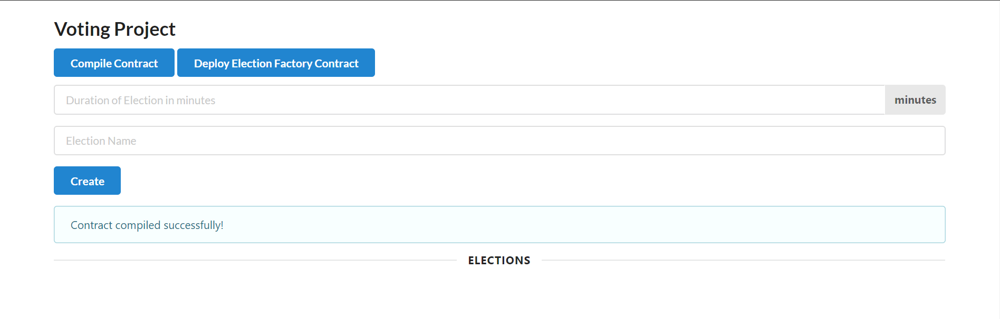</img>

Click on Deploy to deploy the contract.

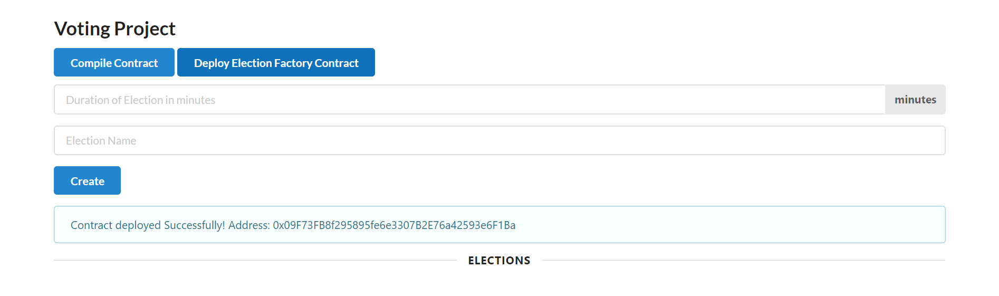</img>

### Step 2:

Create new Election. Pass duration of election in mins and Name of the election.
Click on Create.

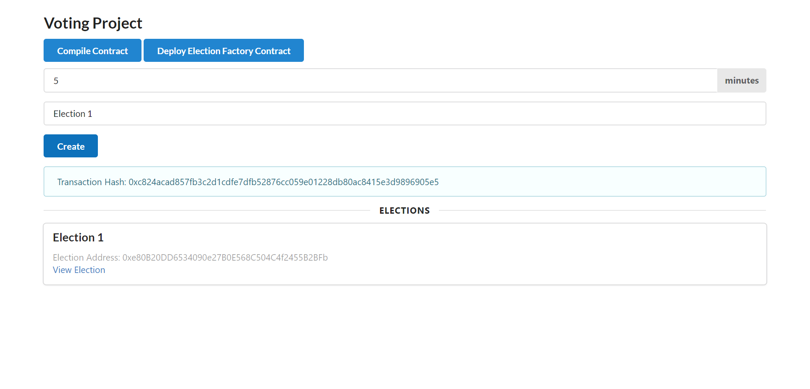</img>

### Step 3:

Go to the new Election.  
Create the Consituencies for the election.  
Pass the consituency Id -- Integer  
Pass the consituency name. String

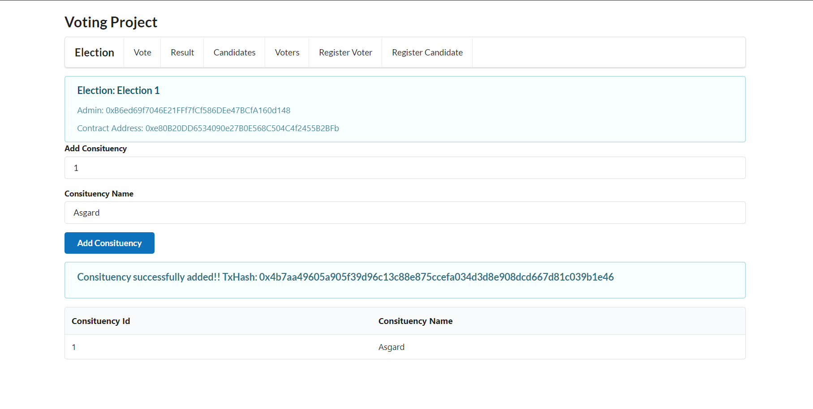</img>

### Step 4:

Click on Register candidates

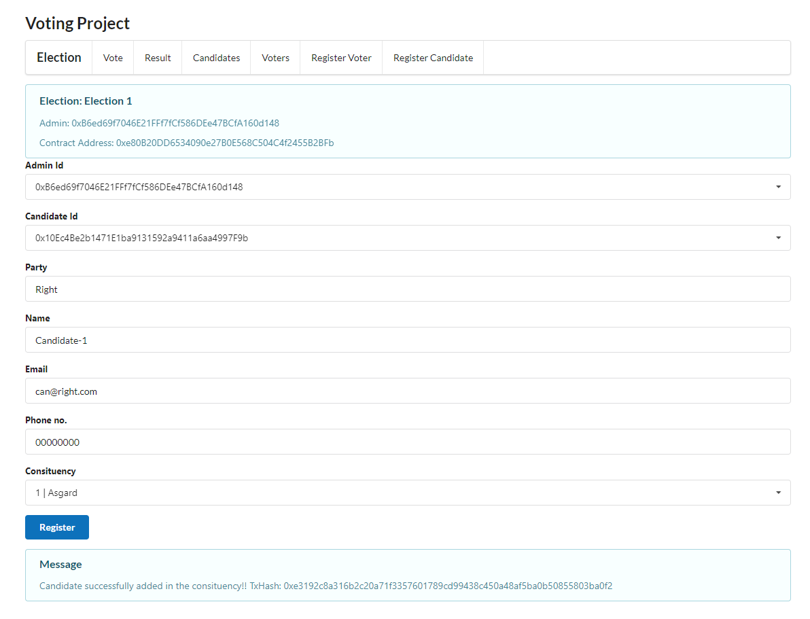 </img>

I have created the extra candidates.

Click on Candidates to see all the registered candidates.

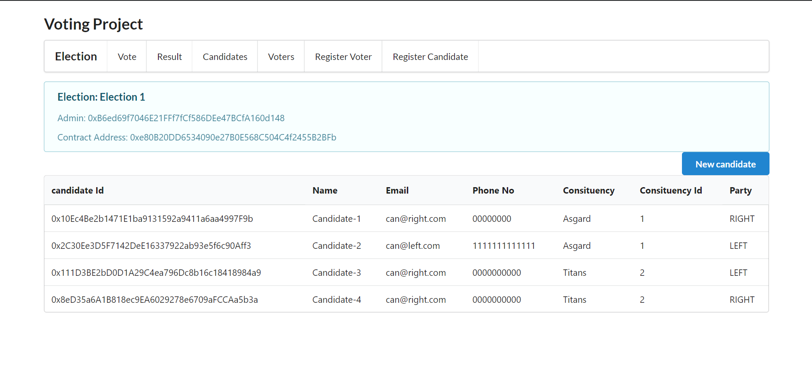</img>

Click on Register voters

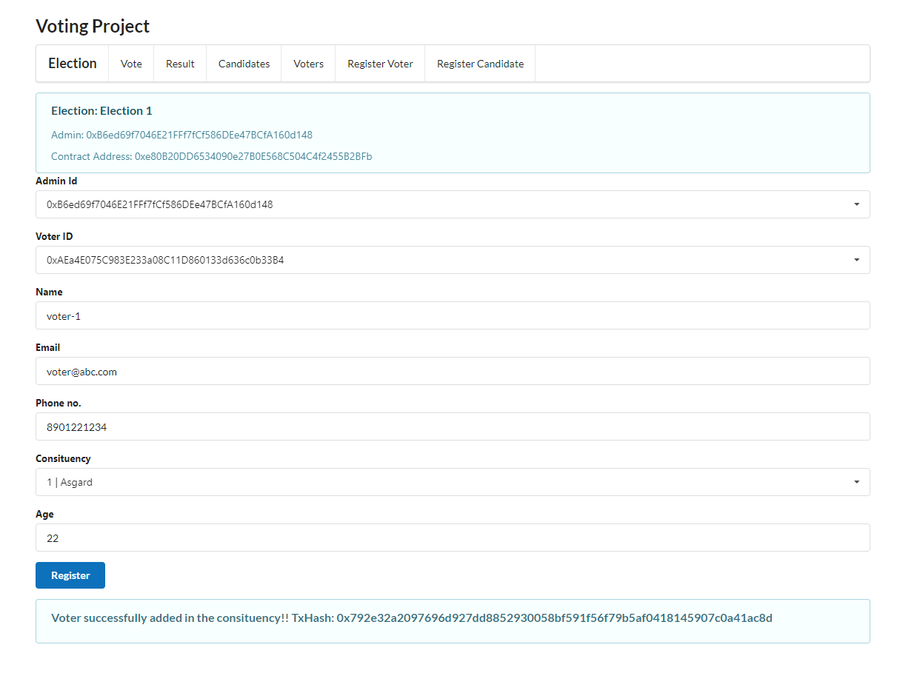</img>

I have created the extra voters.

Click on the Voters to see all the registered voters.

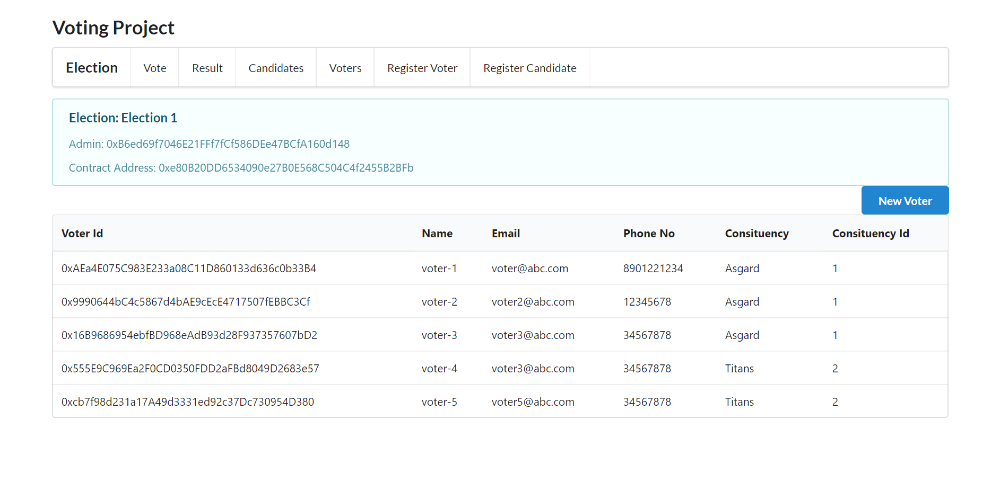</img>

### Step 5:

Vote Tab: Cast Vote

Cast your vote by selecting the voter. Once the voter is selected its respective constituency candidates will gets loaded.

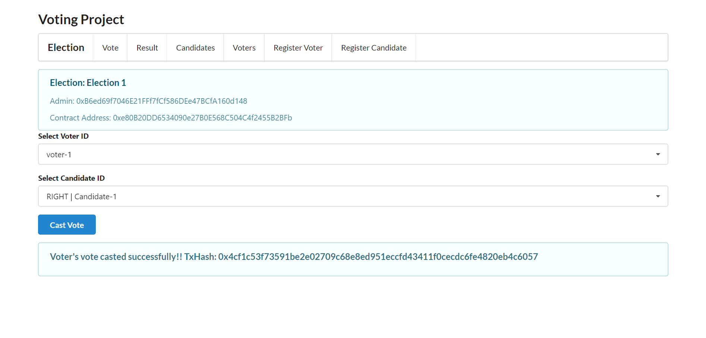</img>

I casted the remaining votes.

### Step 6:

Result Tab:

1. Click on the Close Election to close the election

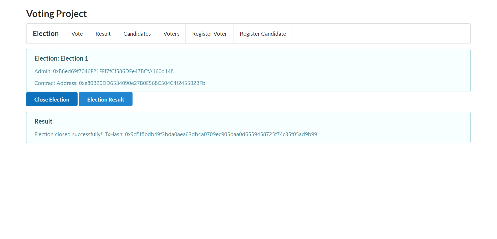</img>

2. Click on the Election Result to get the election result.

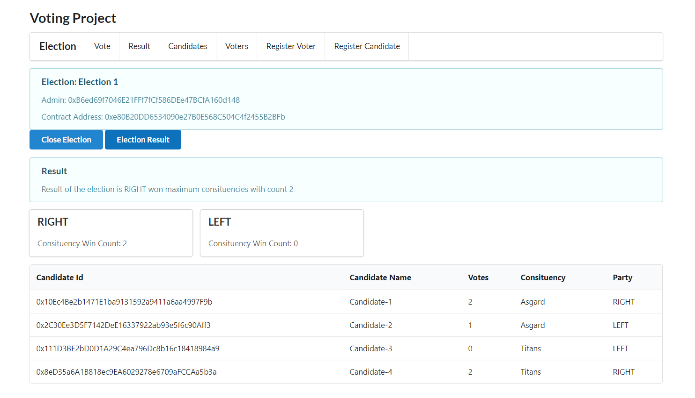</img>

## License

MIT License

Copyright (c) 2019 Shubham Chadokar
